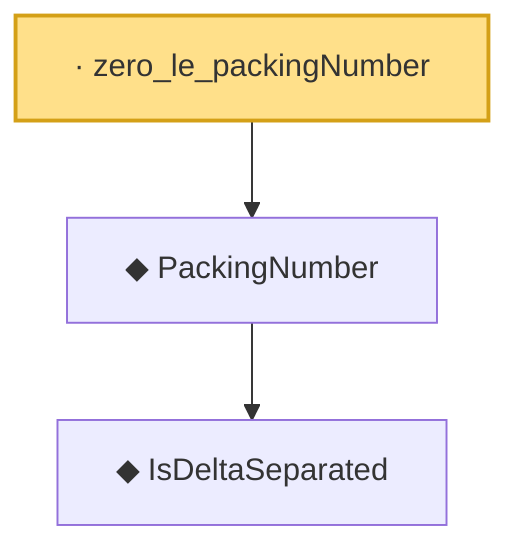

# Proof narrative — zero_le_packingNumber

Root: **zero_le_packingNumber** (lemma) `Statlib/CoxChangePoint/Chaining.lean:129` · topic `CoxChangePoint`
Closure: 3 declarations across 1 files. Generated from `proof_graph.json` — no files were moved.

Reading order (foundations first, headline last):

    ◆ `IsDeltaSeparated` — def · `Statlib/CoxChangePoint/Chaining.lean:107`  _(also used by 1: isDeltaSeparated_zero)_
  ◆ `PackingNumber` — noncomputable def · `Statlib/CoxChangePoint/Chaining.lean:116`  _(also used by 1: DudleyCoveringPackingBound)_
· `zero_le_packingNumber` — lemma · `Statlib/CoxChangePoint/Chaining.lean:129` **← headline**

## Dependency diagram

