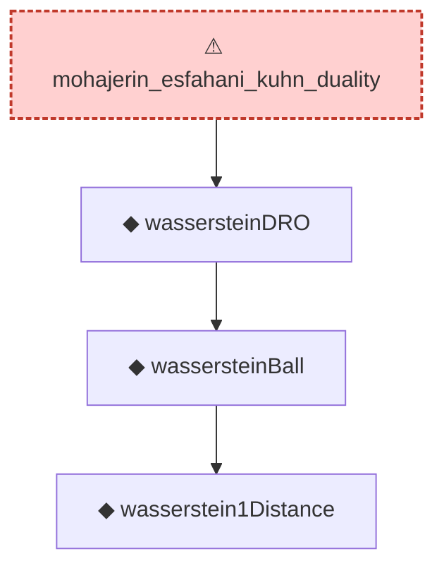

# Proof narrative — mohajerin_esfahani_kuhn_duality

Root: **mohajerin_esfahani_kuhn_duality** (axiom) `Statlib/DRO/mohajerin_esfahani_kuhn_duality.lean:18` · topic `DRO`
Closure: 4 declarations across 4 files. Generated from `proof_graph.json` — no files were moved.

Reading order (foundations first, headline last):

      ◆ `wasserstein1Distance` — noncomputable def · `Statlib/DRO/wasserstein1Distance.lean:12`
    ◆ `wassersteinBall` — def · `Statlib/DRO/wassersteinBall.lean:11`  _(also used by 1: wassersteinBall_mono)_
  ◆ `wassersteinDRO` — noncomputable def · `Statlib/DRO/wassersteinDRO.lean:13`  _(also used by 1: wassersteinDRO_mono)_
⚠ `mohajerin_esfahani_kuhn_duality` — axiom · `Statlib/DRO/mohajerin_esfahani_kuhn_duality.lean:18` **← headline**

## Dependency diagram

> ⚠ `mohajerin_esfahani_kuhn_duality` is an **axiom** (no proof body), so its closure only covers declarations referenced in its *statement*. Supporting lemmas in `DRO/` that were meant to prove it are not edge-connected — a signal that the proof line was atomised then axiomatised apart.
