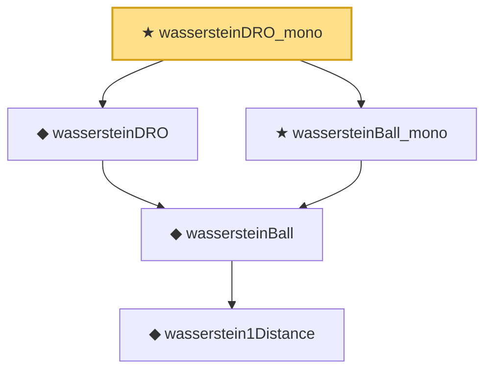

# Proof narrative — wassersteinDRO_mono

Root: **wassersteinDRO_mono** (theorem) `Statlib/DRO/wassersteinDRO_mono.lean:12` · topic `DRO`
Closure: 5 declarations across 5 files. Generated from `proof_graph.json` — no files were moved.

Reading order (foundations first, headline last):

      ◆ `wasserstein1Distance` — noncomputable def · `Statlib/DRO/wasserstein1Distance.lean:12`
    ◆ `wassersteinBall` — def · `Statlib/DRO/wassersteinBall.lean:11`
  ◆ `wassersteinDRO` — noncomputable def · `Statlib/DRO/wassersteinDRO.lean:13`  _(also used by 1: mohajerin_esfahani_kuhn_duality)_
  ★ `wassersteinBall_mono` — theorem · `Statlib/DRO/wassersteinBall_mono.lean:11`
★ `wassersteinDRO_mono` — theorem · `Statlib/DRO/wassersteinDRO_mono.lean:12` **← headline**

## Dependency diagram

