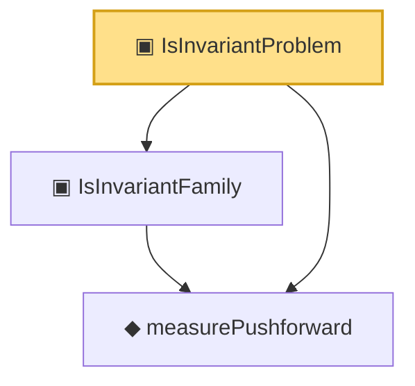

# Proof narrative — IsInvariantProblem

Root: **IsInvariantProblem** (structure) `Statlib/Decision/IsInvariantProblem.lean:34` · topic `Decision`
Closure: 3 declarations across 3 files. Generated from `proof_graph.json` — no files were moved.

Reading order (foundations first, headline last):

  ◆ `measurePushforward` — noncomputable def · `Statlib/Decision/measurePushforward.lean:21`
  ▣ `IsInvariantFamily` — structure · `Statlib/Decision/IsInvariantFamily.lean:23`
▣ `IsInvariantProblem` — structure · `Statlib/Decision/IsInvariantProblem.lean:34` **← headline**

## Dependency diagram

