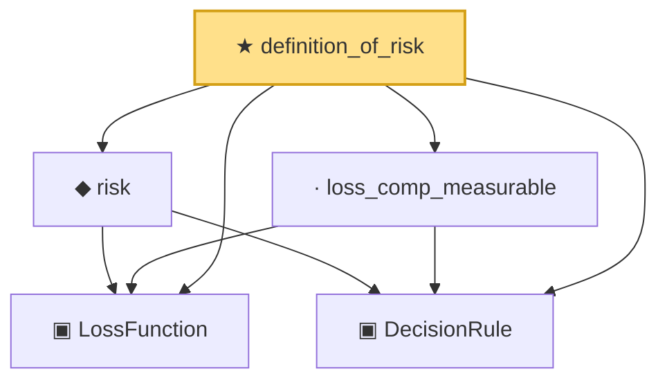

# Proof narrative — definition_of_risk

Root: **definition_of_risk** (theorem) `Statlib/Decision/definition_of_risk.lean:21` · topic `Decision`
Closure: 5 declarations across 5 files. Generated from `proof_graph.json` — no files were moved.

Reading order (foundations first, headline last):

  ▣ `LossFunction` — structure · `Statlib/Decision/LossFunction.lean:16`  _(also used by 5: risk_eq_lintegral, risk_eq_pushforward_integral, risk_integrand_aemeasurable, …)_
  ▣ `DecisionRule` — structure · `Statlib/Decision/DecisionRule.lean:15`  _(also used by 5: risk_eq_lintegral, risk_eq_pushforward_integral, risk_integrand_aemeasurable, …)_
  ◆ `risk` — noncomputable def · `Statlib/Decision/risk.lean:18`  _(also used by 4: risk_eq_lintegral, risk_eq_pushforward_integral, risk_lt_top_iff, …)_
  · `loss_comp_measurable` — lemma · `Statlib/Decision/loss_comp_measurable.lean:17`  _(also used by 1: risk_integrand_aemeasurable)_
★ `definition_of_risk` — theorem · `Statlib/Decision/definition_of_risk.lean:21` **← headline**

## Dependency diagram

