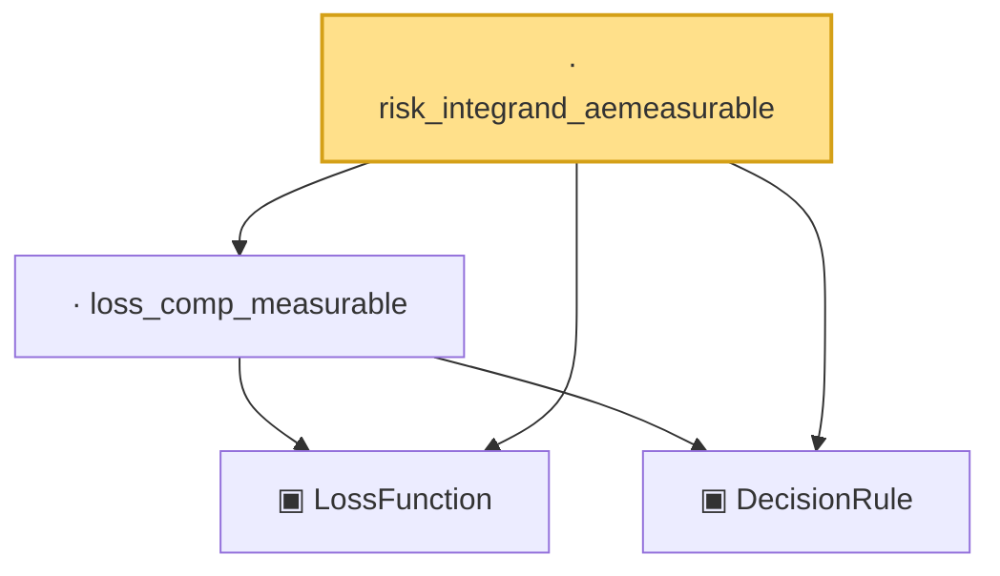

# Proof narrative — risk_integrand_aemeasurable

Root: **risk_integrand_aemeasurable** (lemma) `Statlib/Decision/risk_integrand_aemeasurable.lean:17` · topic `Decision`
Closure: 4 declarations across 4 files. Generated from `proof_graph.json` — no files were moved.

Reading order (foundations first, headline last):

  ▣ `LossFunction` — structure · `Statlib/Decision/LossFunction.lean:16`  _(also used by 6: definition_of_risk, risk, risk_eq_lintegral, …)_
  ▣ `DecisionRule` — structure · `Statlib/Decision/DecisionRule.lean:15`  _(also used by 6: definition_of_risk, risk, risk_eq_lintegral, …)_
  · `loss_comp_measurable` — lemma · `Statlib/Decision/loss_comp_measurable.lean:17`  _(also used by 1: definition_of_risk)_
· `risk_integrand_aemeasurable` — lemma · `Statlib/Decision/risk_integrand_aemeasurable.lean:17` **← headline**

## Dependency diagram

