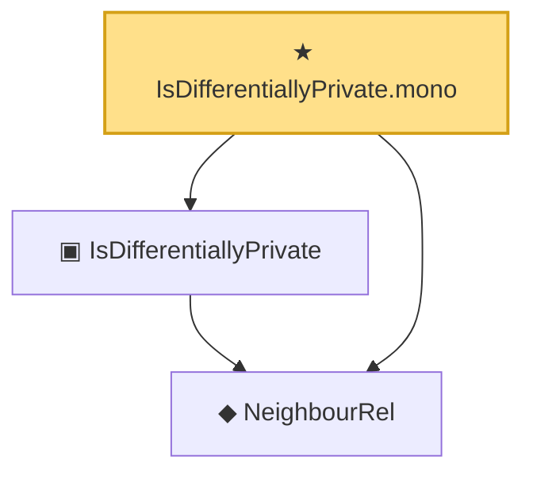

# Proof narrative — IsDifferentiallyPrivate.mono

Root: **IsDifferentiallyPrivate.mono** (theorem) `Statlib/DifferentialPrivacy/IsDifferentiallyPrivate_mono.lean:14` · topic `DifferentialPrivacy`
Closure: 3 declarations across 3 files. Generated from `proof_graph.json` — no files were moved.

Reading order (foundations first, headline last):

  ◆ `NeighbourRel` — abbrev · `Statlib/DifferentialPrivacy/NeighbourRel.lean:14`  _(also used by 9: IsPureDP, IsPureDP.toApprox, composition_sequential, …)_
  ▣ `IsDifferentiallyPrivate` — structure · `Statlib/DifferentialPrivacy/IsDifferentiallyPrivate.lean:18`  _(also used by 5: IsPureDP, IsPureDP.toApprox, composition_sequential, …)_
★ `IsDifferentiallyPrivate.mono` — theorem · `Statlib/DifferentialPrivacy/IsDifferentiallyPrivate_mono.lean:14` **← headline**

## Dependency diagram

