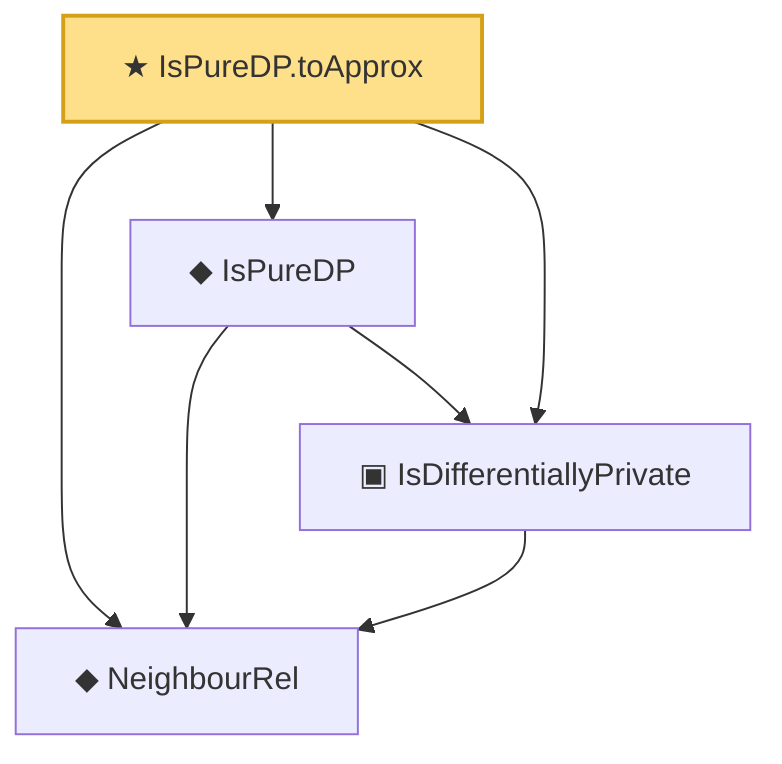

# Proof narrative — IsPureDP.toApprox

Root: **IsPureDP.toApprox** (theorem) `Statlib/DifferentialPrivacy/IsPureDP_toApprox.lean:15` · topic `DifferentialPrivacy`
Closure: 4 declarations across 4 files. Generated from `proof_graph.json` — no files were moved.

Reading order (foundations first, headline last):

  ◆ `NeighbourRel` — abbrev · `Statlib/DifferentialPrivacy/NeighbourRel.lean:14`  _(also used by 8: IsDifferentiallyPrivate.mono, composition_sequential, gaussianMechanism_dp, …)_
  ▣ `IsDifferentiallyPrivate` — structure · `Statlib/DifferentialPrivacy/IsDifferentiallyPrivate.lean:18`  _(also used by 4: IsDifferentiallyPrivate.mono, composition_sequential, gaussianMechanism_dp, …)_
  ◆ `IsPureDP` — def · `Statlib/DifferentialPrivacy/IsPureDP.lean:13`  _(also used by 2: laplaceMechanism_dp, laplaceMechanism_dp_axiom)_
★ `IsPureDP.toApprox` — theorem · `Statlib/DifferentialPrivacy/IsPureDP_toApprox.lean:15` **← headline**

## Dependency diagram

