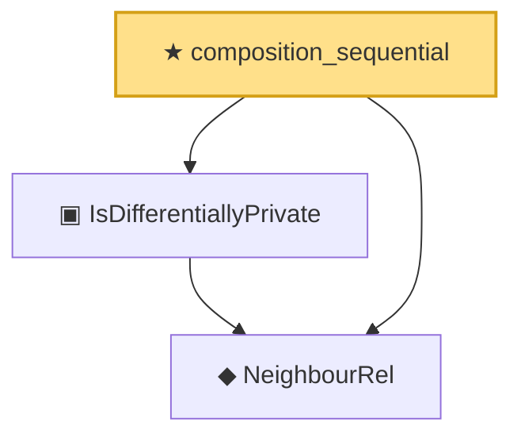

# Proof narrative — composition_sequential

Root: **composition_sequential** (theorem) `Statlib/DifferentialPrivacy/composition_sequential.lean:28` · topic `DifferentialPrivacy`
Closure: 3 declarations across 3 files. Generated from `proof_graph.json` — no files were moved.

Reading order (foundations first, headline last):

  ◆ `NeighbourRel` — abbrev · `Statlib/DifferentialPrivacy/NeighbourRel.lean:14`  _(also used by 9: IsDifferentiallyPrivate.mono, IsPureDP, IsPureDP.toApprox, …)_
  ▣ `IsDifferentiallyPrivate` — structure · `Statlib/DifferentialPrivacy/IsDifferentiallyPrivate.lean:18`  _(also used by 5: IsDifferentiallyPrivate.mono, IsPureDP, IsPureDP.toApprox, …)_
★ `composition_sequential` — theorem · `Statlib/DifferentialPrivacy/composition_sequential.lean:28` **← headline**

## Dependency diagram

