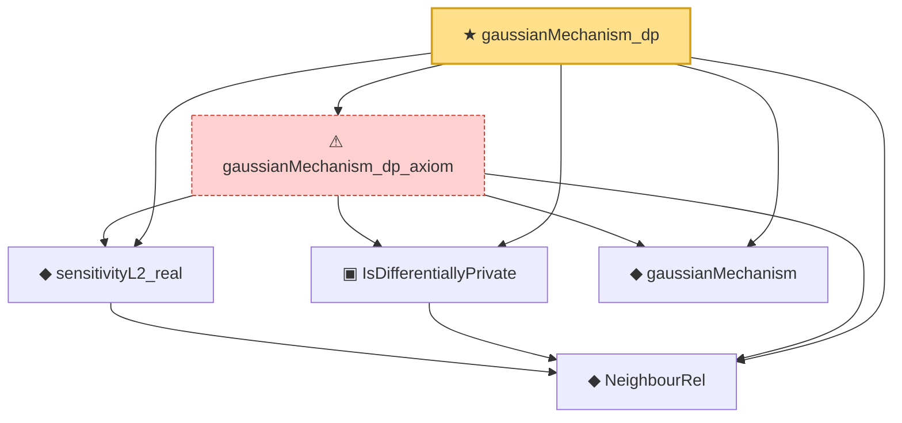

# Proof narrative — gaussianMechanism_dp

Root: **gaussianMechanism_dp** (theorem) `Statlib/DifferentialPrivacy/gaussianMechanism_dp.lean:21` · topic `DifferentialPrivacy`
Closure: 6 declarations across 6 files. Generated from `proof_graph.json` — no files were moved.

Reading order (foundations first, headline last):

  ◆ `NeighbourRel` — abbrev · `Statlib/DifferentialPrivacy/NeighbourRel.lean:14`  _(also used by 7: IsDifferentiallyPrivate.mono, IsPureDP, IsPureDP.toApprox, …)_
  ◆ `sensitivityL2_real` — noncomputable def · `Statlib/DifferentialPrivacy/sensitivityL2_real.lean:19`
  ▣ `IsDifferentiallyPrivate` — structure · `Statlib/DifferentialPrivacy/IsDifferentiallyPrivate.lean:18`  _(also used by 4: IsDifferentiallyPrivate.mono, IsPureDP, IsPureDP.toApprox, …)_
  ◆ `gaussianMechanism` — noncomputable def · `Statlib/DifferentialPrivacy/gaussianMechanism.lean:13`
  ⚠ `gaussianMechanism_dp_axiom` — axiom · `Statlib/DifferentialPrivacy/gaussianMechanism_dp_axiom.lean:38`
★ `gaussianMechanism_dp` — theorem · `Statlib/DifferentialPrivacy/gaussianMechanism_dp.lean:21` **← headline**

## Dependency diagram

