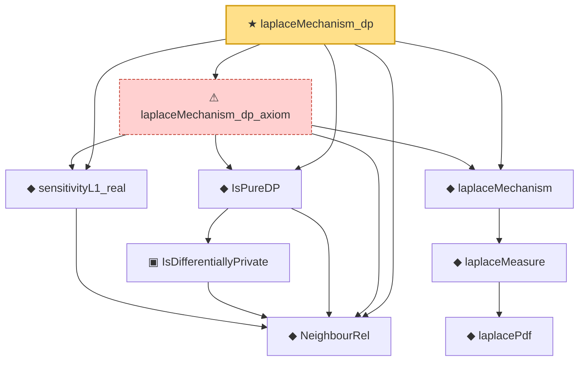

# Proof narrative — laplaceMechanism_dp

Root: **laplaceMechanism_dp** (theorem) `Statlib/DifferentialPrivacy/laplaceMechanism_dp.lean:21` · topic `DifferentialPrivacy`
Closure: 9 declarations across 9 files. Generated from `proof_graph.json` — no files were moved.

Reading order (foundations first, headline last):

  ◆ `NeighbourRel` — abbrev · `Statlib/DifferentialPrivacy/NeighbourRel.lean:14`  _(also used by 6: IsDifferentiallyPrivate.mono, IsPureDP.toApprox, composition_sequential, …)_
  ◆ `sensitivityL1_real` — noncomputable def · `Statlib/DifferentialPrivacy/sensitivityL1_real.lean:19`
    ▣ `IsDifferentiallyPrivate` — structure · `Statlib/DifferentialPrivacy/IsDifferentiallyPrivate.lean:18`  _(also used by 5: IsDifferentiallyPrivate.mono, IsPureDP.toApprox, composition_sequential, …)_
  ◆ `IsPureDP` — def · `Statlib/DifferentialPrivacy/IsPureDP.lean:13`  _(also used by 1: IsPureDP.toApprox)_
      ◆ `laplacePdf` — noncomputable def · `Statlib/DifferentialPrivacy/laplacePdf.lean:14`
    ◆ `laplaceMeasure` — noncomputable def · `Statlib/DifferentialPrivacy/laplaceMeasure.lean:15`
  ◆ `laplaceMechanism` — noncomputable def · `Statlib/DifferentialPrivacy/laplaceMechanism.lean:13`
  ⚠ `laplaceMechanism_dp_axiom` — axiom · `Statlib/DifferentialPrivacy/laplaceMechanism_dp_axiom.lean:24`
★ `laplaceMechanism_dp` — theorem · `Statlib/DifferentialPrivacy/laplaceMechanism_dp.lean:21` **← headline**

## Dependency diagram

