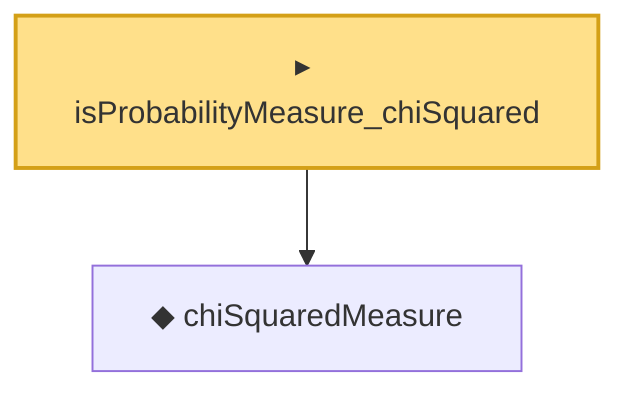

# Proof narrative — isProbabilityMeasure_chiSquared

Root: **isProbabilityMeasure_chiSquared** (instance) `Statlib/Distribution/isProbabilityMeasure_chiSquared.lean:15` · topic `Distribution`
Closure: 2 declarations across 2 files. Generated from `proof_graph.json` — no files were moved.

Reading order (foundations first, headline last):

  ◆ `chiSquaredMeasure` — def · `Statlib/Distribution/chiSquaredMeasure.lean:15`  _(also used by 2: ustatistic_degenerate_limit_second_moment, ustatistic_degenerate_partial_sum_sq_moment)_
▸ `isProbabilityMeasure_chiSquared` — instance · `Statlib/Distribution/isProbabilityMeasure_chiSquared.lean:15` **← headline**

## Dependency diagram

