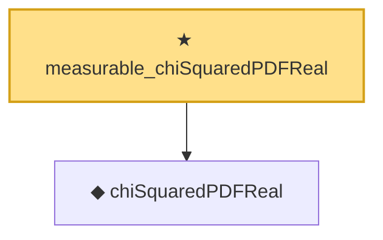

# Proof narrative — measurable_chiSquaredPDFReal

Root: **measurable_chiSquaredPDFReal** (theorem) `Statlib/Distribution/measurable_chiSquaredPDFReal.lean:17` · topic `Distribution`
Closure: 2 declarations across 2 files. Generated from `proof_graph.json` — no files were moved.

Reading order (foundations first, headline last):

  ◆ `chiSquaredPDFReal` — def · `Statlib/Distribution/chiSquaredPDFReal.lean:17`
★ `measurable_chiSquaredPDFReal` — theorem · `Statlib/Distribution/measurable_chiSquaredPDFReal.lean:17` **← headline**

## Dependency diagram

