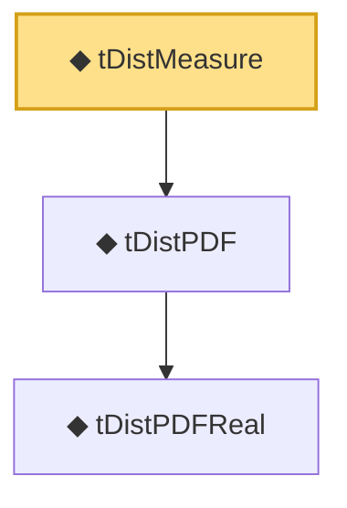

# Proof narrative — tDistMeasure

Root: **tDistMeasure** (def) `Statlib/Distribution/tDistMeasure.lean:16` · topic `Distribution`
Closure: 3 declarations across 3 files. Generated from `proof_graph.json` — no files were moved.

Reading order (foundations first, headline last):

    ◆ `tDistPDFReal` — def · `Statlib/Distribution/tDistPDFReal.lean:16`  _(also used by 4: measurable_tDistPDFReal, tDistPDFReal_neg, tDistPDFReal_nonneg, …)_
  ◆ `tDistPDF` — def · `Statlib/Distribution/tDistPDF.lean:16`
◆ `tDistMeasure` — def · `Statlib/Distribution/tDistMeasure.lean:16` **← headline**

## Dependency diagram

