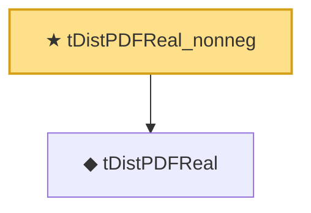

# Proof narrative — tDistPDFReal_nonneg

Root: **tDistPDFReal_nonneg** (theorem) `Statlib/Distribution/tDistPDFReal_nonneg.lean:16` · topic `Distribution`
Closure: 2 declarations across 2 files. Generated from `proof_graph.json` — no files were moved.

Reading order (foundations first, headline last):

  ◆ `tDistPDFReal` — def · `Statlib/Distribution/tDistPDFReal.lean:16`  _(also used by 4: measurable_tDistPDFReal, tDistPDF, tDistPDFReal_neg, …)_
★ `tDistPDFReal_nonneg` — theorem · `Statlib/Distribution/tDistPDFReal_nonneg.lean:16` **← headline**

## Dependency diagram

