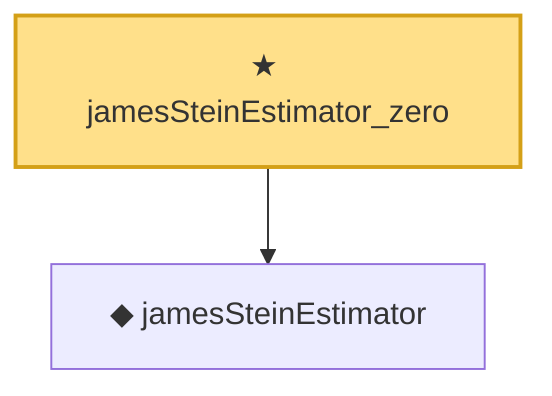

# Proof narrative — jamesSteinEstimator_zero

Root: **jamesSteinEstimator_zero** (theorem) `Statlib/EmpiricalBayes/jamesSteinEstimator_zero.lean:13` · topic `EmpiricalBayes`
Closure: 2 declarations across 2 files. Generated from `proof_graph.json` — no files were moved.

Reading order (foundations first, headline last):

  ◆ `jamesSteinEstimator` — noncomputable def · `Statlib/EmpiricalBayes/jamesSteinEstimator.lean:15`  _(also used by 3: jamesSteinEstimator_apply, stein_dominance, stein_dominance_axiom)_
★ `jamesSteinEstimator_zero` — theorem · `Statlib/EmpiricalBayes/jamesSteinEstimator_zero.lean:13` **← headline**

## Dependency diagram

