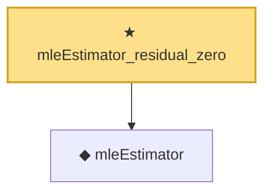

# Proof narrative — mleEstimator_residual_zero

Root: **mleEstimator_residual_zero** (theorem) `Statlib/EmpiricalBayes/mleEstimator_residual_zero.lean:13` · topic `EmpiricalBayes`
Closure: 2 declarations across 2 files. Generated from `proof_graph.json` — no files were moved.

Reading order (foundations first, headline last):

  ◆ `mleEstimator` — def · `Statlib/EmpiricalBayes/mleEstimator.lean:10`  _(also used by 3: mleEstimator_id, stein_dominance, stein_dominance_axiom)_
★ `mleEstimator_residual_zero` — theorem · `Statlib/EmpiricalBayes/mleEstimator_residual_zero.lean:13` **← headline**

## Dependency diagram

