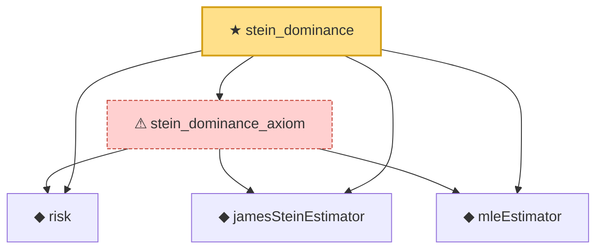

# Proof narrative — stein_dominance

Root: **stein_dominance** (theorem) `Statlib/EmpiricalBayes/stein_dominance.lean:24` · topic `EmpiricalBayes`
Closure: 5 declarations across 5 files. Generated from `proof_graph.json` — no files were moved.

Reading order (foundations first, headline last):

  ◆ `risk` — noncomputable def · `Statlib/EmpiricalBayes/risk.lean:12`
  ◆ `jamesSteinEstimator` — noncomputable def · `Statlib/EmpiricalBayes/jamesSteinEstimator.lean:15`  _(also used by 2: jamesSteinEstimator_apply, jamesSteinEstimator_zero)_
  ◆ `mleEstimator` — def · `Statlib/EmpiricalBayes/mleEstimator.lean:10`  _(also used by 2: mleEstimator_id, mleEstimator_residual_zero)_
  ⚠ `stein_dominance_axiom` — axiom · `Statlib/EmpiricalBayes/stein_dominance_axiom.lean:17`
★ `stein_dominance` — theorem · `Statlib/EmpiricalBayes/stein_dominance.lean:24` **← headline**

## Dependency diagram

