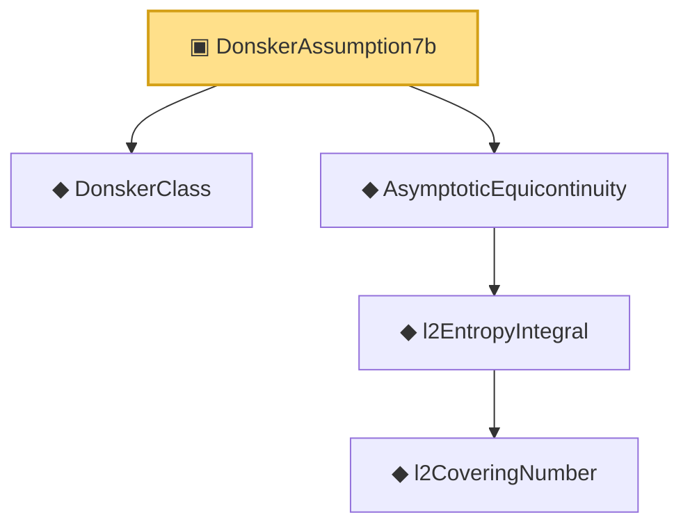

# Proof narrative — DonskerAssumption7b

Root: **DonskerAssumption7b** (structure) `Statlib/EmpiricalProcess/Donsker.lean:160` · topic `EmpiricalProcess`
Closure: 5 declarations across 3 files. Generated from `proof_graph.json` — no files were moved.

Reading order (foundations first, headline last):

  ◆ `DonskerClass` — def · `Statlib/EmpiricalProcess/Donsker.lean:135`  _(also used by 5: donsker_theorem, empiricalProcess_as_scaled_sum, donskerClass_of_entropy_bound, …)_
      ◆ `l2CoveringNumber` — def · `Statlib/EmpiricalProcess/DonskerInfra.lean:16`
    ◆ `l2EntropyIntegral` — def · `Statlib/EmpiricalProcess/DonskerInfra.lean:21`  _(also used by 2: donskerClass_of_entropy_bound, StrongDonskerClass)_
  ◆ `AsymptoticEquicontinuity` — def · `Statlib/EmpiricalProcess/Equicontinuity.lean:34`  _(also used by 2: variance_le_l2_sq, StrongDonskerClass)_
▣ `DonskerAssumption7b` — structure · `Statlib/EmpiricalProcess/Donsker.lean:160` **← headline**

## Dependency diagram

