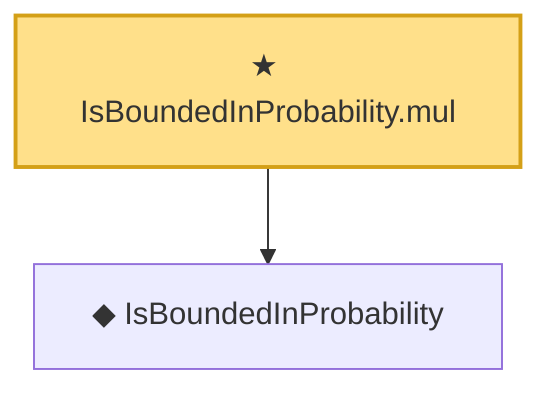

# Proof narrative — IsBoundedInProbability.mul

Root: **IsBoundedInProbability.mul** (theorem) `Statlib/EmpiricalProcess/StochasticOrder.lean:217` · topic `EmpiricalProcess`
Closure: 2 declarations across 1 files. Generated from `proof_graph.json` — no files were moved.

Reading order (foundations first, headline last):

  ◆ `IsBoundedInProbability` — def · `Statlib/EmpiricalProcess/StochasticOrder.lean:42`  _(also used by 20: rate, toRate, cox_theorem_2_end_to_end, …)_
★ `IsBoundedInProbability.mul` — theorem · `Statlib/EmpiricalProcess/StochasticOrder.lean:217` **← headline**

## Dependency diagram

