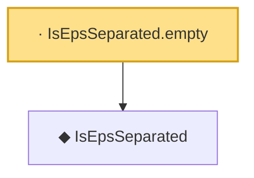

# Proof narrative — IsEpsSeparated.empty

Root: **IsEpsSeparated.empty** (lemma) `Statlib/EmpiricalProcess/DudleySudakov.lean:69` · topic `EmpiricalProcess`
Closure: 2 declarations across 1 files. Generated from `proof_graph.json` — no files were moved.

Reading order (foundations first, headline last):

  ◆ `IsEpsSeparated` — def · `Statlib/EmpiricalProcess/DudleySudakov.lean:59`  _(also used by 2: packingNumber, IsEpsSeparated.subset)_
· `IsEpsSeparated.empty` — lemma · `Statlib/EmpiricalProcess/DudleySudakov.lean:69` **← headline**

## Dependency diagram

