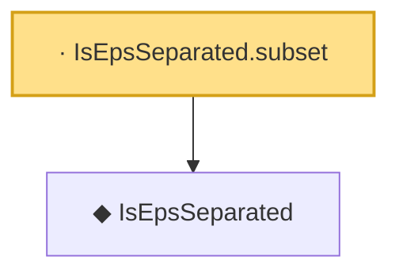

# Proof narrative — IsEpsSeparated.subset

Root: **IsEpsSeparated.subset** (lemma) `Statlib/EmpiricalProcess/DudleySudakov.lean:73` · topic `EmpiricalProcess`
Closure: 2 declarations across 1 files. Generated from `proof_graph.json` — no files were moved.

Reading order (foundations first, headline last):

  ◆ `IsEpsSeparated` — def · `Statlib/EmpiricalProcess/DudleySudakov.lean:59`  _(also used by 2: packingNumber, IsEpsSeparated.empty)_
· `IsEpsSeparated.subset` — lemma · `Statlib/EmpiricalProcess/DudleySudakov.lean:73` **← headline**

## Dependency diagram

