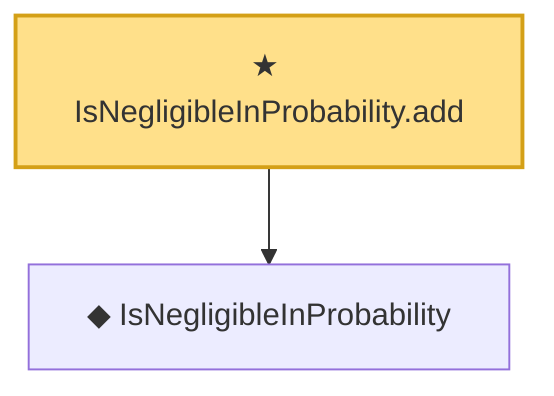

# Proof narrative — IsNegligibleInProbability.add

Root: **IsNegligibleInProbability.add** (theorem) `Statlib/EmpiricalProcess/StochasticOrder.lean:96` · topic `EmpiricalProcess`
Closure: 2 declarations across 1 files. Generated from `proof_graph.json` — no files were moved.

Reading order (foundations first, headline last):

  ◆ `IsNegligibleInProbability` — def · `Statlib/EmpiricalProcess/StochasticOrder.lean:49`  _(also used by 7: lemma_s3_oP, IsNegligibleInProbability.isBoundedInProbability, isNegligibleInProbability_zero, …)_
★ `IsNegligibleInProbability.add` — theorem · `Statlib/EmpiricalProcess/StochasticOrder.lean:96` **← headline**

## Dependency diagram

