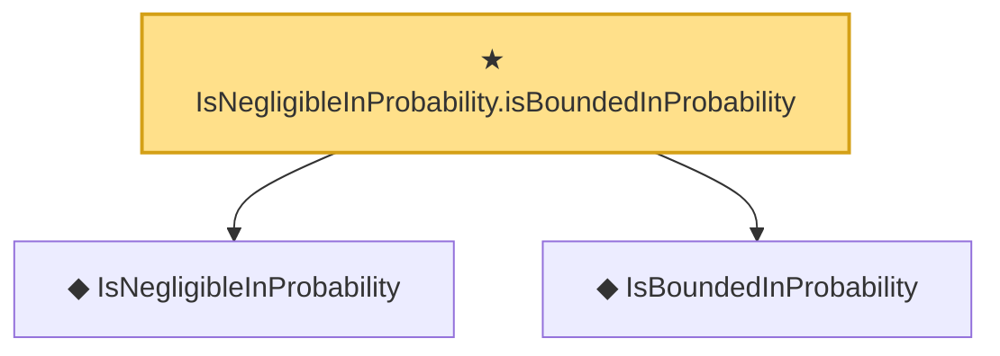

# Proof narrative — IsNegligibleInProbability.isBoundedInProbability

Root: **IsNegligibleInProbability.isBoundedInProbability** (theorem) `Statlib/EmpiricalProcess/StochasticOrder.lean:66` · topic `EmpiricalProcess`
Closure: 3 declarations across 1 files. Generated from `proof_graph.json` — no files were moved.

Reading order (foundations first, headline last):

  ◆ `IsNegligibleInProbability` — def · `Statlib/EmpiricalProcess/StochasticOrder.lean:49`  _(also used by 7: lemma_s3_oP, IsNegligibleInProbability.add, isNegligibleInProbability_zero, …)_
  ◆ `IsBoundedInProbability` — def · `Statlib/EmpiricalProcess/StochasticOrder.lean:42`  _(also used by 20: rate, toRate, cox_theorem_2_end_to_end, …)_
★ `IsNegligibleInProbability.isBoundedInProbability` — theorem · `Statlib/EmpiricalProcess/StochasticOrder.lean:66` **← headline**

## Dependency diagram

