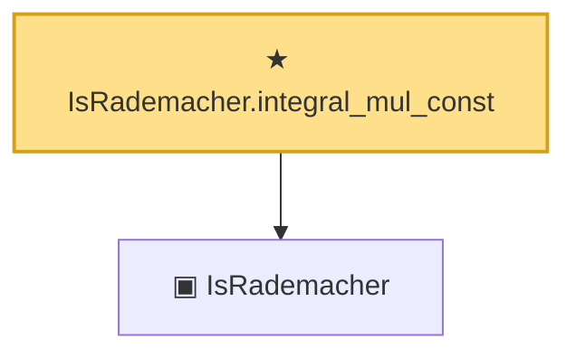

# Proof narrative — IsRademacher.integral_mul_const

Root: **IsRademacher.integral_mul_const** (theorem) `Statlib/EmpiricalProcess/Symmetrization.lean:60` · topic `EmpiricalProcess`
Closure: 2 declarations across 1 files. Generated from `proof_graph.json` — no files were moved.

Reading order (foundations first, headline last):

  ▣ `IsRademacher` — structure · `Statlib/EmpiricalProcess/Symmetrization.lean:40`  _(also used by 3: IsRademacher.integral_eq_zero, IsRademacher.variance_eq_one, rademacher_indep_integral_zero)_
★ `IsRademacher.integral_mul_const` — theorem · `Statlib/EmpiricalProcess/Symmetrization.lean:60` **← headline**

## Dependency diagram

