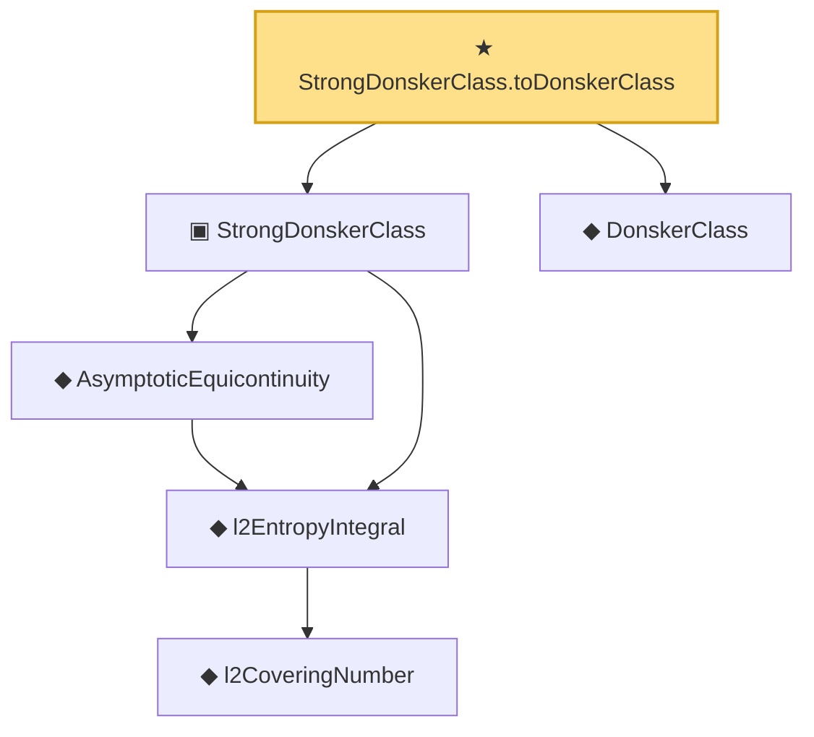

# Proof narrative — StrongDonskerClass.toDonskerClass

Root: **StrongDonskerClass.toDonskerClass** (theorem) `Statlib/EmpiricalProcess/Equicontinuity.lean:43` · topic `EmpiricalProcess`
Closure: 6 declarations across 3 files. Generated from `proof_graph.json` — no files were moved.

Reading order (foundations first, headline last):

        ◆ `l2CoveringNumber` — def · `Statlib/EmpiricalProcess/DonskerInfra.lean:16`
    ◆ `l2EntropyIntegral` — def · `Statlib/EmpiricalProcess/DonskerInfra.lean:21`  _(also used by 1: donskerClass_of_entropy_bound)_
    ◆ `AsymptoticEquicontinuity` — def · `Statlib/EmpiricalProcess/Equicontinuity.lean:34`  _(also used by 2: DonskerAssumption7b, variance_le_l2_sq)_
  ▣ `StrongDonskerClass` — structure · `Statlib/EmpiricalProcess/Equicontinuity.lean:37`
  ◆ `DonskerClass` — def · `Statlib/EmpiricalProcess/Donsker.lean:135`  _(also used by 5: donsker_theorem, empiricalProcess_as_scaled_sum, DonskerAssumption7b, …)_
★ `StrongDonskerClass.toDonskerClass` — theorem · `Statlib/EmpiricalProcess/Equicontinuity.lean:43` **← headline**

## Dependency diagram

