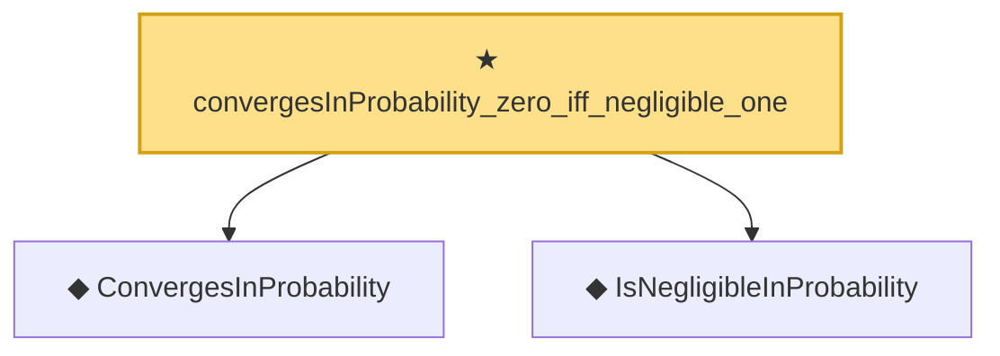

# Proof narrative — convergesInProbability_zero_iff_negligible_one

Root: **convergesInProbability_zero_iff_negligible_one** (theorem) `Statlib/EmpiricalProcess/StochasticOrder.lean:158` · topic `EmpiricalProcess`
Closure: 3 declarations across 1 files. Generated from `proof_graph.json` — no files were moved.

Reading order (foundations first, headline last):

  ◆ `ConvergesInProbability` — def · `Statlib/EmpiricalProcess/StochasticOrder.lean:54`  _(also used by 9: benchmark_convergesInProbability, consistency, cox_consistency_end_to_end, …)_
  ◆ `IsNegligibleInProbability` — def · `Statlib/EmpiricalProcess/StochasticOrder.lean:49`  _(also used by 7: lemma_s3_oP, IsNegligibleInProbability.isBoundedInProbability, IsNegligibleInProbability.add, …)_
★ `convergesInProbability_zero_iff_negligible_one` — theorem · `Statlib/EmpiricalProcess/StochasticOrder.lean:158` **← headline**

## Dependency diagram

