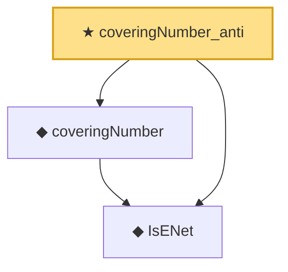

# Proof narrative — coveringNumber_anti

Root: **coveringNumber_anti** (theorem) `Statlib/EmpiricalProcess/CoveringNumber.lean:46` · topic `EmpiricalProcess`
Closure: 3 declarations across 1 files. Generated from `proof_graph.json` — no files were moved.

Reading order (foundations first, headline last):

  ◆ `IsENet` — def · `Statlib/EmpiricalProcess/CoveringNumber.lean:26`  _(also used by 4: coveringNumber_mono, coveringNumber_lt_top_of_totallyBounded, exists_finset_enet_of_totallyBounded, …)_
  ◆ `coveringNumber` — def · `Statlib/EmpiricalProcess/CoveringNumber.lean:31`  _(also used by 11: metricEntropy, coveringNumber_mono, coveringNumber_lt_top_of_totallyBounded, …)_
★ `coveringNumber_anti` — theorem · `Statlib/EmpiricalProcess/CoveringNumber.lean:46` **← headline**

## Dependency diagram

