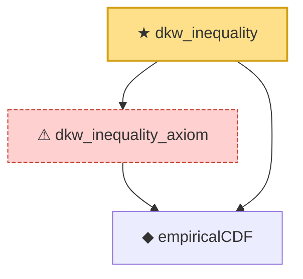

# Proof narrative — dkw_inequality

Root: **dkw_inequality** (theorem) `Statlib/EmpiricalProcess/DKW.lean:162` · topic `EmpiricalProcess`
Closure: 3 declarations across 1 files. Generated from `proof_graph.json` — no files were moved.

Reading order (foundations first, headline last):

  ◆ `empiricalCDF` — def · `Statlib/EmpiricalProcess/DKW.lean:63`  _(also used by 3: empiricalCDF_monotone, empiricalCDF_le_one, empiricalCDF_nonneg)_
  ⚠ `dkw_inequality_axiom` — axiom · `Statlib/EmpiricalProcess/DKW.lean:130`
★ `dkw_inequality` — theorem · `Statlib/EmpiricalProcess/DKW.lean:162` **← headline**

## Dependency diagram

