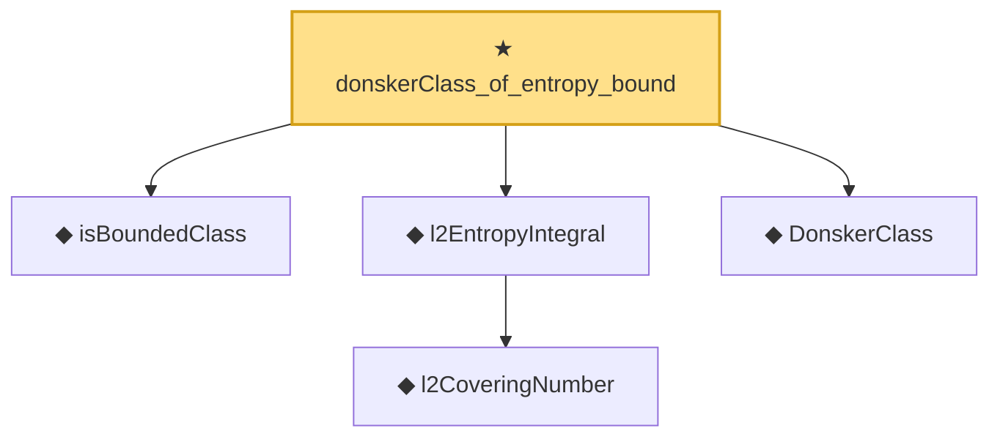

# Proof narrative — donskerClass_of_entropy_bound

Root: **donskerClass_of_entropy_bound** (theorem) `Statlib/EmpiricalProcess/DonskerInfra.lean:37` · topic `EmpiricalProcess`
Closure: 5 declarations across 2 files. Generated from `proof_graph.json` — no files were moved.

Reading order (foundations first, headline last):

  ◆ `isBoundedClass` — def · `Statlib/EmpiricalProcess/DonskerInfra.lean:12`
    ◆ `l2CoveringNumber` — def · `Statlib/EmpiricalProcess/DonskerInfra.lean:16`
  ◆ `l2EntropyIntegral` — def · `Statlib/EmpiricalProcess/DonskerInfra.lean:21`  _(also used by 2: AsymptoticEquicontinuity, StrongDonskerClass)_
  ◆ `DonskerClass` — def · `Statlib/EmpiricalProcess/Donsker.lean:135`  _(also used by 5: donsker_theorem, empiricalProcess_as_scaled_sum, DonskerAssumption7b, …)_
★ `donskerClass_of_entropy_bound` — theorem · `Statlib/EmpiricalProcess/DonskerInfra.lean:37` **← headline**

## Dependency diagram

