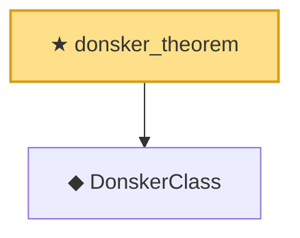

# Proof narrative — donsker_theorem

Root: **donsker_theorem** (theorem) `Statlib/EmpiricalProcess/Chaining.lean:225` · topic `EmpiricalProcess`
Closure: 2 declarations across 2 files. Generated from `proof_graph.json` — no files were moved.

Reading order (foundations first, headline last):

  ◆ `DonskerClass` — def · `Statlib/EmpiricalProcess/Donsker.lean:135`  _(also used by 5: empiricalProcess_as_scaled_sum, DonskerAssumption7b, donskerClass_of_entropy_bound, …)_
★ `donsker_theorem` — theorem · `Statlib/EmpiricalProcess/Chaining.lean:225` **← headline**

## Dependency diagram

