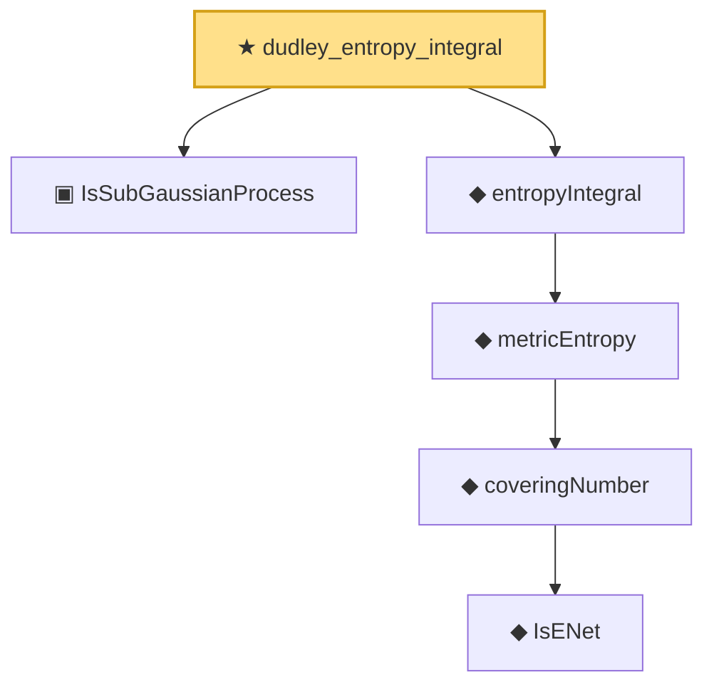

# Proof narrative — dudley_entropy_integral

Root: **dudley_entropy_integral** (theorem) `Statlib/EmpiricalProcess/Dudley.lean:1471` · topic `EmpiricalProcess`
Closure: 6 declarations across 2 files. Generated from `proof_graph.json` — no files were moved.

Reading order (foundations first, headline last):

  ▣ `IsSubGaussianProcess` — structure · `Statlib/EmpiricalProcess/Dudley.lean:188`  _(also used by 12: dudley_single_level_finite, subgaussian_chernoff_single, subgaussian_sup'_tail_bound, …)_
        ◆ `IsENet` — def · `Statlib/EmpiricalProcess/CoveringNumber.lean:26`  _(also used by 5: coveringNumber_anti, coveringNumber_mono, coveringNumber_lt_top_of_totallyBounded, …)_
      ◆ `coveringNumber` — def · `Statlib/EmpiricalProcess/CoveringNumber.lean:31`  _(also used by 11: coveringNumber_anti, coveringNumber_mono, coveringNumber_lt_top_of_totallyBounded, …)_
    ◆ `metricEntropy` — def · `Statlib/EmpiricalProcess/CoveringNumber.lean:35`  _(also used by 1: l1_ball_covering_maurey)_
  ◆ `entropyIntegral` — def · `Statlib/EmpiricalProcess/CoveringNumber.lean:40`  _(also used by 1: dudley_bound_nonneg)_
★ `dudley_entropy_integral` — theorem · `Statlib/EmpiricalProcess/Dudley.lean:1471` **← headline**

## Dependency diagram

