# Proof narrative — dudley_finite_chaining

Root: **dudley_finite_chaining** (theorem) `Statlib/EmpiricalProcess/Dudley.lean:1388` · topic `EmpiricalProcess`
Closure: 30 declarations across 2 files. Generated from `proof_graph.json` — no files were moved.

Reading order (foundations first, headline last):

  ▣ `IsSubGaussianProcess` — structure · `Statlib/EmpiricalProcess/Dudley.lean:188`  _(also used by 4: dudley_single_level_finite, dudley_entropy_integral, sudakov_minoration, …)_
  ◆ `nearestPoint` — noncomputable def · `Statlib/EmpiricalProcess/CoveringNumber.lean:103`  _(also used by 2: dist_nearestPoint_le, dist_nearestPoint_le_of_enet)_
        · `sup'_add_le` — private lemma · `Statlib/EmpiricalProcess/Dudley.lean:1117`
        · `inf'_add_le` — private lemma · `Statlib/EmpiricalProcess/Dudley.lean:1121`
      ★ `range_add_le` — theorem · `Statlib/EmpiricalProcess/Dudley.lean:1126`
      ★ `sup'_comp_le` — theorem · `Statlib/EmpiricalProcess/Dudley.lean:1132`
      ★ `inf'_comp_le` — theorem · `Statlib/EmpiricalProcess/Dudley.lean:1138`
    ★ `chaining_step_pointwise` — theorem · `Statlib/EmpiricalProcess/Dudley.lean:1152`
  ★ `chaining_telescope_range` — theorem · `Statlib/EmpiricalProcess/Dudley.lean:1176`
  ★ `nearestPoint_mem` — theorem · `Statlib/EmpiricalProcess/CoveringNumber.lean:109`
    · `finset_sup'_add_const` — private lemma · `Statlib/EmpiricalProcess/Dudley.lean:752`
    · `finset_inf'_add_const` — private lemma · `Statlib/EmpiricalProcess/Dudley.lean:761`
  · `integrable_finset_sup'` — private lemma · `Statlib/EmpiricalProcess/Dudley.lean:720`
  · `integrable_finset_inf'` — private lemma · `Statlib/EmpiricalProcess/Dudley.lean:736`
      · `lintegral_subgaussian_tail_ne_top` — private lemma · `Statlib/EmpiricalProcess/Dudley.lean:288`
      · `lintegral_subgaussian_tail_toReal` — private lemma · `Statlib/EmpiricalProcess/Dudley.lean:302`
    ★ `expected_value_from_subgaussian_tail` — theorem · `Statlib/EmpiricalProcess/Dudley.lean:345`
      · `sup'_tail_le_sum_tail` — lemma · `Statlib/EmpiricalProcess/Dudley.lean:773`
      ★ `chernoff_from_mgf` — theorem · `Statlib/EmpiricalProcess/Dudley.lean:626`  _(also used by 1: subgaussian_pair_tail_diameter)_
      · `subgaussian_chernoff_single` — lemma · `Statlib/EmpiricalProcess/Dudley.lean:673`  _(also used by 1: subgaussian_pair_tail_diameter)_
    · `subgaussian_sup'_tail_bound` — lemma · `Statlib/EmpiricalProcess/Dudley.lean:819`
      · `neg_inf'_tail_le_sum_tail` — lemma · `Statlib/EmpiricalProcess/Dudley.lean:791`
    · `subgaussian_neg_inf'_tail_bound` — lemma · `Statlib/EmpiricalProcess/Dudley.lean:874`
  ★ `hFiniteBound_of_subgaussian` — theorem · `Statlib/EmpiricalProcess/Dudley.lean:939`
    ★ `sharp_expected_value_from_subgaussian_tail` — theorem · `Statlib/EmpiricalProcess/Dudley.lean:483`
  ★ `sharp_hFiniteBound_of_subgaussian` — theorem · `Statlib/EmpiricalProcess/Dudley.lean:1042`
    ★ `increment_sup_tail` — theorem · `Statlib/EmpiricalProcess/Dudley.lean:1211`
    ★ `increment_neg_inf_tail` — theorem · `Statlib/EmpiricalProcess/Dudley.lean:1250`
  ★ `increment_range_bound` — theorem · `Statlib/EmpiricalProcess/Dudley.lean:1299`
★ `dudley_finite_chaining` — theorem · `Statlib/EmpiricalProcess/Dudley.lean:1388` **← headline**

## Dependency diagram

```mermaid
flowchart TD
  n0["▣ IsSubGaussianProcess"]
  n1["◆ nearestPoint"]
  n2["· sup'_add_le"]
  n3["· inf'_add_le"]
  n4["★ range_add_le"]
  n5["★ sup'_comp_le"]
  n6["★ inf'_comp_le"]
  n7["★ chaining_step_pointwise"]
  n8["★ chaining_telescope_range"]
  n9["★ nearestPoint_mem"]
  n10["· finset_sup'_add_const"]
  n11["· finset_inf'_add_const"]
  n12["· integrable_finset_sup'"]
  n13["· integrable_finset_inf'"]
  n14["· lintegral_subgaussian_tail_ne_top"]
  n15["· lintegral_subgaussian_tail_toReal"]
  n16["★ expected_value_from_subgaussian_tail"]
  n17["· sup'_tail_le_sum_tail"]
  n18["★ chernoff_from_mgf"]
  n19["· subgaussian_chernoff_single"]
  n20["· subgaussian_sup'_tail_bound"]
  n21["· neg_inf'_tail_le_sum_tail"]
  n22["· subgaussian_neg_inf'_tail_bound"]
  n23["★ hFiniteBound_of_subgaussian"]
  n24["★ sharp_expected_value_from_subgaussian_tail"]
  n25["★ sharp_hFiniteBound_of_subgaussian"]
  n26["★ increment_sup_tail"]
  n27["★ increment_neg_inf_tail"]
  n28["★ increment_range_bound"]
  n29["★ dudley_finite_chaining"]
  n4 --> n2
  n4 --> n3
  n7 --> n4
  n7 --> n5
  n7 --> n6
  n8 --> n7
  n9 --> n1
  n16 --> n14
  n16 --> n15
  n19 --> n0
  n19 --> n18
  n20 --> n0
  n20 --> n17
  n20 --> n18
  n20 --> n19
  n22 --> n0
  n22 --> n21
  n22 --> n18
  n22 --> n19
  n23 --> n0
  n23 --> n10
  n23 --> n11
  n23 --> n12
  n23 --> n13
  n23 --> n16
  n23 --> n20
  n23 --> n22
  n24 --> n16
  n25 --> n0
  n25 --> n12
  n25 --> n13
  n25 --> n10
  n25 --> n11
  n25 --> n24
  n25 --> n20
  n25 --> n22
  n26 --> n0
  n26 --> n17
  n26 --> n18
  n26 --> n19
  n27 --> n0
  n27 --> n21
  n27 --> n18
  n27 --> n19
  n28 --> n0
  n28 --> n12
  n28 --> n13
  n28 --> n24
  n28 --> n26
  n28 --> n27
  n29 --> n0
  n29 --> n1
  n29 --> n8
  n29 --> n9
  n29 --> n23
  n29 --> n12
  n29 --> n13
  n29 --> n25
  n29 --> n28
  class n29 headline;
  classDef headline fill:#ffe08a,stroke:#d4a017,stroke-width:2px;
  classDef axiomNode fill:#ffd0d0,stroke:#c0392b,stroke-dasharray:4 2;
```

