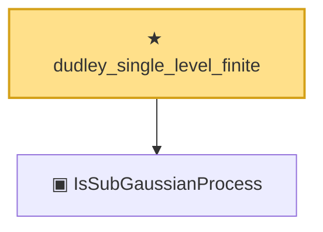

# Proof narrative — dudley_single_level_finite

Root: **dudley_single_level_finite** (theorem) `Statlib/EmpiricalProcess/Dudley.lean:569` · topic `EmpiricalProcess`
Closure: 2 declarations across 1 files. Generated from `proof_graph.json` — no files were moved.

Reading order (foundations first, headline last):

  ▣ `IsSubGaussianProcess` — structure · `Statlib/EmpiricalProcess/Dudley.lean:188`  _(also used by 12: subgaussian_chernoff_single, subgaussian_sup'_tail_bound, subgaussian_neg_inf'_tail_bound, …)_
★ `dudley_single_level_finite` — theorem · `Statlib/EmpiricalProcess/Dudley.lean:569` **← headline**

## Dependency diagram

