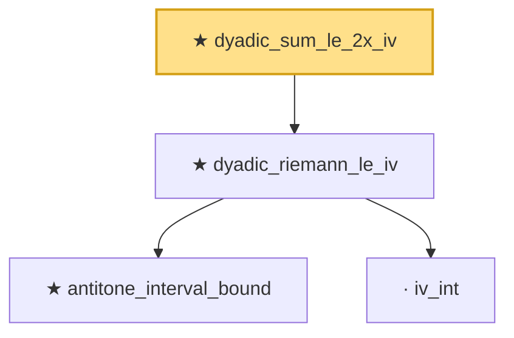

# Proof narrative — dyadic_sum_le_2x_iv

Root: **dyadic_sum_le_2x_iv** (theorem) `Statlib/EmpiricalProcess/RiemannSum.lean:33` · topic `EmpiricalProcess`
Closure: 4 declarations across 2 files. Generated from `proof_graph.json` — no files were moved.

Reading order (foundations first, headline last):

    ★ `antitone_interval_bound` — theorem · `Statlib/EmpiricalProcess/Dudley.lean:1195`
    · `iv_int` — private lemma · `Statlib/EmpiricalProcess/RiemannSum.lean:5`
  ★ `dyadic_riemann_le_iv` — theorem · `Statlib/EmpiricalProcess/RiemannSum.lean:10`
★ `dyadic_sum_le_2x_iv` — theorem · `Statlib/EmpiricalProcess/RiemannSum.lean:33` **← headline**

## Dependency diagram

