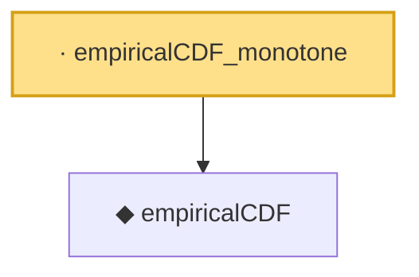

# Proof narrative — empiricalCDF_monotone

Root: **empiricalCDF_monotone** (lemma) `Statlib/EmpiricalProcess/DKW.lean:68` · topic `EmpiricalProcess`
Closure: 2 declarations across 1 files. Generated from `proof_graph.json` — no files were moved.

Reading order (foundations first, headline last):

  ◆ `empiricalCDF` — def · `Statlib/EmpiricalProcess/DKW.lean:63`  _(also used by 4: empiricalCDF_le_one, empiricalCDF_nonneg, dkw_inequality_axiom, …)_
· `empiricalCDF_monotone` — lemma · `Statlib/EmpiricalProcess/DKW.lean:68` **← headline**

## Dependency diagram

