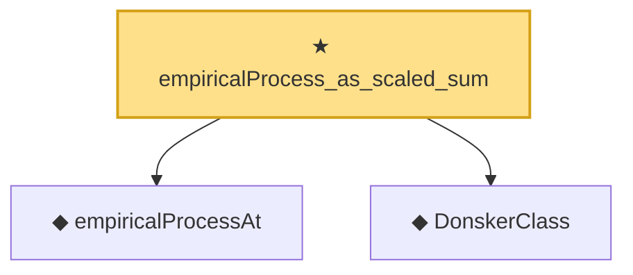

# Proof narrative — empiricalProcess_as_scaled_sum

Root: **empiricalProcess_as_scaled_sum** (theorem) `Statlib/EmpiricalProcess/Donsker.lean:91` · topic `EmpiricalProcess`
Closure: 3 declarations across 1 files. Generated from `proof_graph.json` — no files were moved.

Reading order (foundations first, headline last):

  ◆ `empiricalProcessAt` — def · `Statlib/EmpiricalProcess/Donsker.lean:63`  _(also used by 2: empiricalProcess_sub, empiricalProcess_diff_eq)_
  ◆ `DonskerClass` — def · `Statlib/EmpiricalProcess/Donsker.lean:135`  _(also used by 5: donsker_theorem, DonskerAssumption7b, donskerClass_of_entropy_bound, …)_
★ `empiricalProcess_as_scaled_sum` — theorem · `Statlib/EmpiricalProcess/Donsker.lean:91` **← headline**

## Dependency diagram

