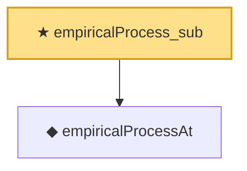

# Proof narrative — empiricalProcess_sub

Root: **empiricalProcess_sub** (theorem) `Statlib/EmpiricalProcess/Donsker.lean:76` · topic `EmpiricalProcess`
Closure: 2 declarations across 1 files. Generated from `proof_graph.json` — no files were moved.

Reading order (foundations first, headline last):

  ◆ `empiricalProcessAt` — def · `Statlib/EmpiricalProcess/Donsker.lean:63`  _(also used by 2: empiricalProcess_as_scaled_sum, empiricalProcess_diff_eq)_
★ `empiricalProcess_sub` — theorem · `Statlib/EmpiricalProcess/Donsker.lean:76` **← headline**

## Dependency diagram

