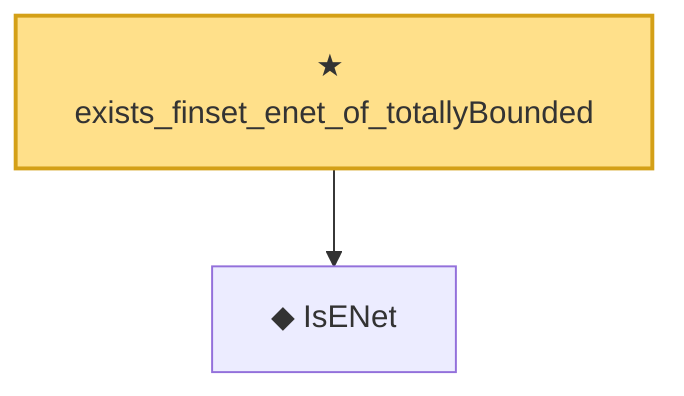

# Proof narrative — exists_finset_enet_of_totallyBounded

Root: **exists_finset_enet_of_totallyBounded** (theorem) `Statlib/EmpiricalProcess/CoveringNumber.lean:91` · topic `EmpiricalProcess`
Closure: 2 declarations across 1 files. Generated from `proof_graph.json` — no files were moved.

Reading order (foundations first, headline last):

  ◆ `IsENet` — def · `Statlib/EmpiricalProcess/CoveringNumber.lean:26`  _(also used by 5: coveringNumber, coveringNumber_anti, coveringNumber_mono, …)_
★ `exists_finset_enet_of_totallyBounded` — theorem · `Statlib/EmpiricalProcess/CoveringNumber.lean:91` **← headline**

## Dependency diagram

