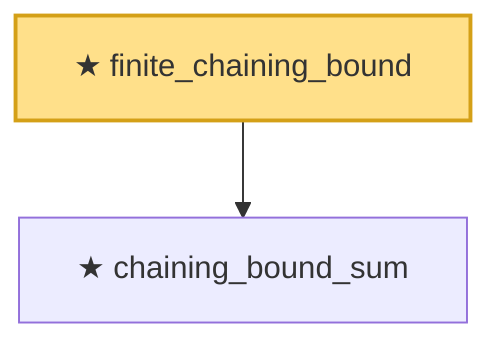

# Proof narrative — finite_chaining_bound

Root: **finite_chaining_bound** (theorem) `Statlib/EmpiricalProcess/Dudley.lean:135` · topic `EmpiricalProcess`
Closure: 2 declarations across 2 files. Generated from `proof_graph.json` — no files were moved.

Reading order (foundations first, headline last):

  ★ `chaining_bound_sum` — theorem · `Statlib/EmpiricalProcess/Chaining.lean:67`
★ `finite_chaining_bound` — theorem · `Statlib/EmpiricalProcess/Dudley.lean:135` **← headline**

## Dependency diagram

