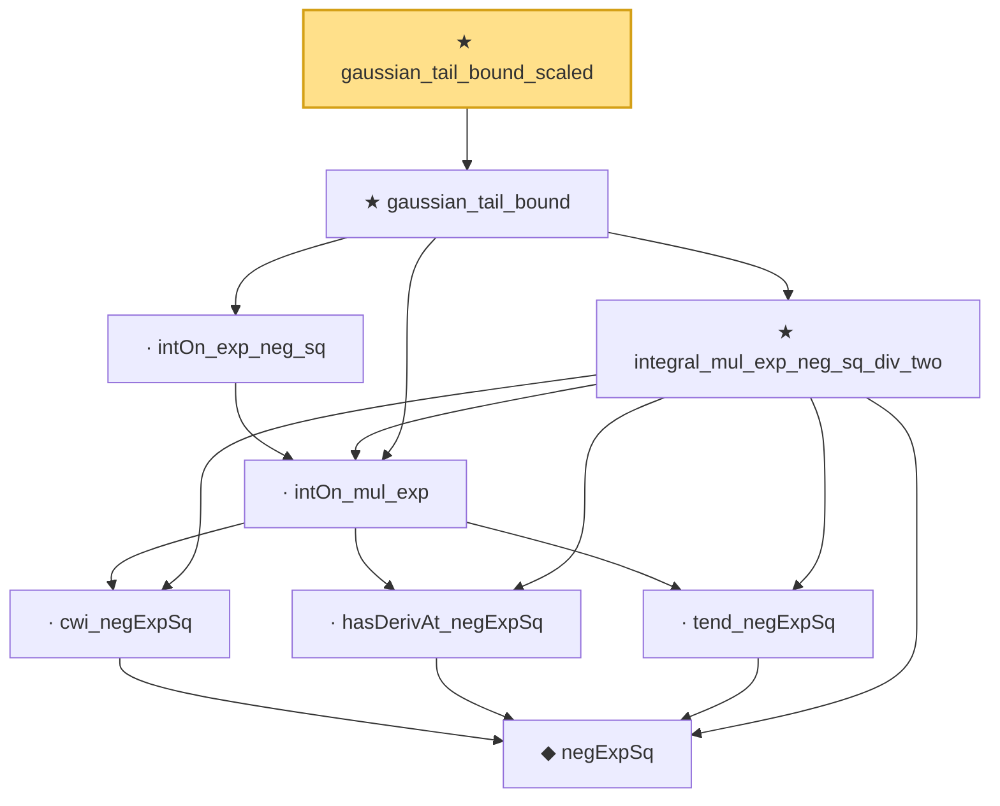

# Proof narrative — gaussian_tail_bound_scaled

Root: **gaussian_tail_bound_scaled** (theorem) `Statlib/EmpiricalProcess/Dudley.lean:445` · topic `EmpiricalProcess`
Closure: 9 declarations across 1 files. Generated from `proof_graph.json` — no files were moved.

Reading order (foundations first, headline last):

      ◆ `negExpSq` — private def · `Statlib/EmpiricalProcess/Dudley.lean:379`
      · `cwi_negExpSq` — private lemma · `Statlib/EmpiricalProcess/Dudley.lean:391`
      · `hasDerivAt_negExpSq` — private lemma · `Statlib/EmpiricalProcess/Dudley.lean:384`
      · `tend_negExpSq` — private lemma · `Statlib/EmpiricalProcess/Dudley.lean:395`
    · `intOn_mul_exp` — private lemma · `Statlib/EmpiricalProcess/Dudley.lean:405`
    · `intOn_exp_neg_sq` — private lemma · `Statlib/EmpiricalProcess/Dudley.lean:418`
    ★ `integral_mul_exp_neg_sq_div_two` — theorem · `Statlib/EmpiricalProcess/Dudley.lean:412`
  ★ `gaussian_tail_bound` — theorem · `Statlib/EmpiricalProcess/Dudley.lean:429`
★ `gaussian_tail_bound_scaled` — theorem · `Statlib/EmpiricalProcess/Dudley.lean:445` **← headline**

## Dependency diagram

