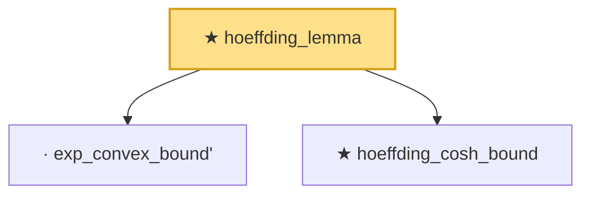

# Proof narrative — hoeffding_lemma

Root: **hoeffding_lemma** (theorem) `Statlib/EmpiricalProcess/HoeffdingLemma.lean:32` · topic `EmpiricalProcess`
Closure: 3 declarations across 2 files. Generated from `proof_graph.json` — no files were moved.

Reading order (foundations first, headline last):

  · `exp_convex_bound'` — private lemma · `Statlib/EmpiricalProcess/HoeffdingLemma.lean:13`
  ★ `hoeffding_cosh_bound` — theorem · `Statlib/EmpiricalProcess/Chaining.lean:159`
★ `hoeffding_lemma` — theorem · `Statlib/EmpiricalProcess/HoeffdingLemma.lean:32` **← headline**

## Dependency diagram

