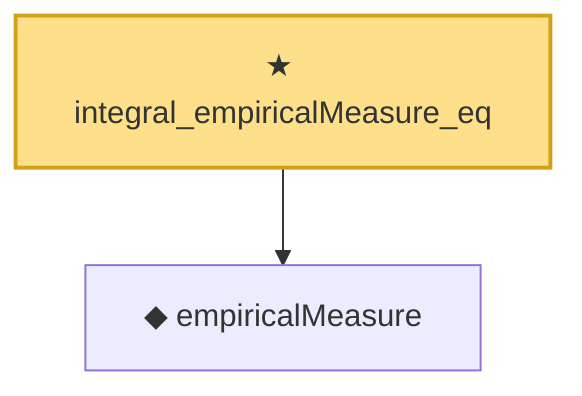

# Proof narrative — integral_empiricalMeasure_eq

Root: **integral_empiricalMeasure_eq** (theorem) `Statlib/EmpiricalProcess/Donsker.lean:39` · topic `EmpiricalProcess`
Closure: 2 declarations across 1 files. Generated from `proof_graph.json` — no files were moved.

Reading order (foundations first, headline last):

  ◆ `empiricalMeasure` — def · `Statlib/EmpiricalProcess/Donsker.lean:34`
★ `integral_empiricalMeasure_eq` — theorem · `Statlib/EmpiricalProcess/Donsker.lean:39` **← headline**

## Dependency diagram

