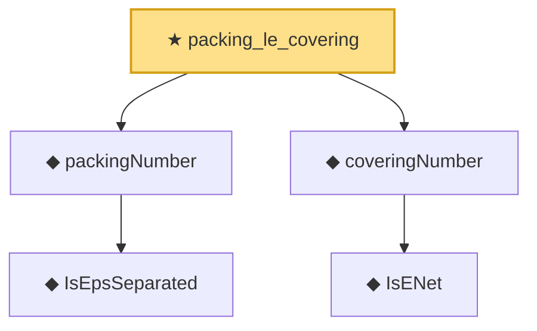

# Proof narrative — packing_le_covering

Root: **packing_le_covering** (theorem) `Statlib/EmpiricalProcess/DudleySudakov.lean:79` · topic `EmpiricalProcess`
Closure: 5 declarations across 2 files. Generated from `proof_graph.json` — no files were moved.

Reading order (foundations first, headline last):

    ◆ `IsEpsSeparated` — def · `Statlib/EmpiricalProcess/DudleySudakov.lean:59`  _(also used by 2: IsEpsSeparated.empty, IsEpsSeparated.subset)_
  ◆ `packingNumber` — def · `Statlib/EmpiricalProcess/DudleySudakov.lean:65`
    ◆ `IsENet` — def · `Statlib/EmpiricalProcess/CoveringNumber.lean:26`  _(also used by 5: coveringNumber_anti, coveringNumber_mono, coveringNumber_lt_top_of_totallyBounded, …)_
  ◆ `coveringNumber` — def · `Statlib/EmpiricalProcess/CoveringNumber.lean:31`  _(also used by 11: metricEntropy, coveringNumber_anti, coveringNumber_mono, …)_
★ `packing_le_covering` — theorem · `Statlib/EmpiricalProcess/DudleySudakov.lean:79` **← headline**

## Dependency diagram

