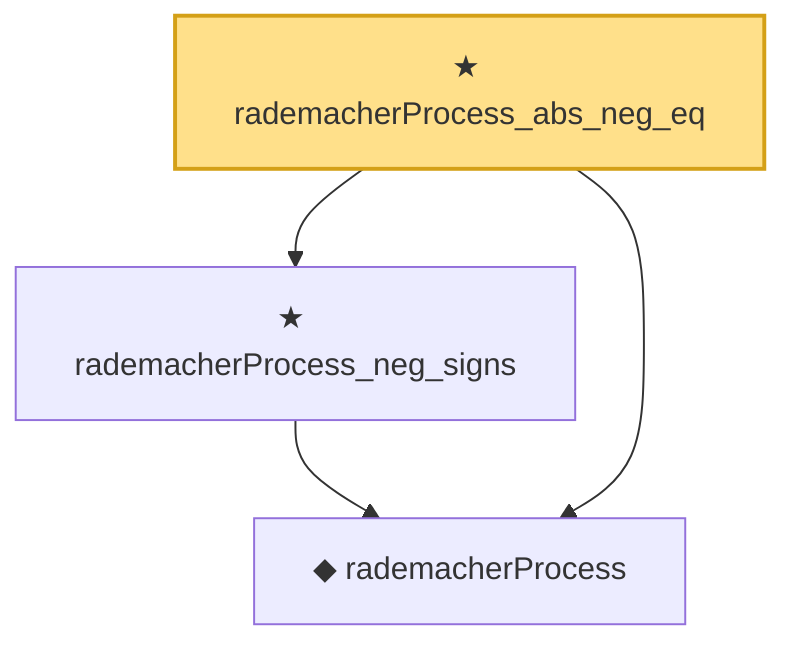

# Proof narrative — rademacherProcess_abs_neg_eq

Root: **rademacherProcess_abs_neg_eq** (theorem) `Statlib/EmpiricalProcess/Symmetrization.lean:125` · topic `EmpiricalProcess`
Closure: 3 declarations across 1 files. Generated from `proof_graph.json` — no files were moved.

Reading order (foundations first, headline last):

  ◆ `rademacherProcess` — def · `Statlib/EmpiricalProcess/Symmetrization.lean:94`  _(also used by 1: rademacherProcess_add)_
  ★ `rademacherProcess_neg_signs` — theorem · `Statlib/EmpiricalProcess/Symmetrization.lean:114`
★ `rademacherProcess_abs_neg_eq` — theorem · `Statlib/EmpiricalProcess/Symmetrization.lean:125` **← headline**

## Dependency diagram

