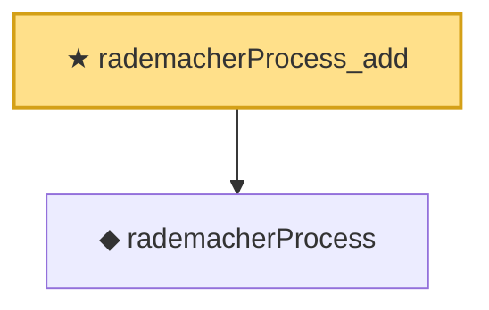

# Proof narrative — rademacherProcess_add

Root: **rademacherProcess_add** (theorem) `Statlib/EmpiricalProcess/Symmetrization.lean:106` · topic `EmpiricalProcess`
Closure: 2 declarations across 1 files. Generated from `proof_graph.json` — no files were moved.

Reading order (foundations first, headline last):

  ◆ `rademacherProcess` — def · `Statlib/EmpiricalProcess/Symmetrization.lean:94`  _(also used by 2: rademacherProcess_neg_signs, rademacherProcess_abs_neg_eq)_
★ `rademacherProcess_add` — theorem · `Statlib/EmpiricalProcess/Symmetrization.lean:106` **← headline**

## Dependency diagram

