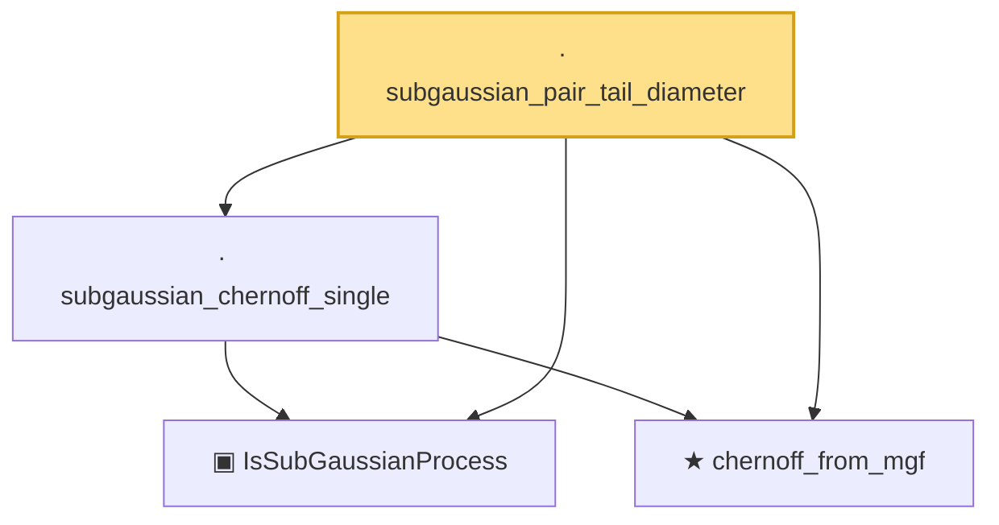

# Proof narrative — subgaussian_pair_tail_diameter

Root: **subgaussian_pair_tail_diameter** (lemma) `Statlib/EmpiricalProcess/DudleySudakov.lean:194` · topic `EmpiricalProcess`
Closure: 4 declarations across 2 files. Generated from `proof_graph.json` — no files were moved.

Reading order (foundations first, headline last):

  ▣ `IsSubGaussianProcess` — structure · `Statlib/EmpiricalProcess/Dudley.lean:188`  _(also used by 11: dudley_single_level_finite, subgaussian_sup'_tail_bound, subgaussian_neg_inf'_tail_bound, …)_
  ★ `chernoff_from_mgf` — theorem · `Statlib/EmpiricalProcess/Dudley.lean:626`  _(also used by 4: subgaussian_sup'_tail_bound, subgaussian_neg_inf'_tail_bound, increment_sup_tail, …)_
  · `subgaussian_chernoff_single` — lemma · `Statlib/EmpiricalProcess/Dudley.lean:673`  _(also used by 4: subgaussian_sup'_tail_bound, subgaussian_neg_inf'_tail_bound, increment_sup_tail, …)_
· `subgaussian_pair_tail_diameter` — lemma · `Statlib/EmpiricalProcess/DudleySudakov.lean:194` **← headline**

## Dependency diagram

