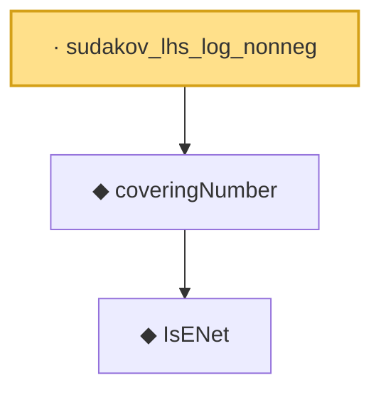

# Proof narrative — sudakov_lhs_log_nonneg

Root: **sudakov_lhs_log_nonneg** (lemma) `Statlib/EmpiricalProcess/DudleySudakov.lean:272` · topic `EmpiricalProcess`
Closure: 3 declarations across 2 files. Generated from `proof_graph.json` — no files were moved.

Reading order (foundations first, headline last):

    ◆ `IsENet` — def · `Statlib/EmpiricalProcess/CoveringNumber.lean:26`  _(also used by 5: coveringNumber_anti, coveringNumber_mono, coveringNumber_lt_top_of_totallyBounded, …)_
  ◆ `coveringNumber` — def · `Statlib/EmpiricalProcess/CoveringNumber.lean:31`  _(also used by 11: metricEntropy, coveringNumber_anti, coveringNumber_mono, …)_
· `sudakov_lhs_log_nonneg` — lemma · `Statlib/EmpiricalProcess/DudleySudakov.lean:272` **← headline**

## Dependency diagram

