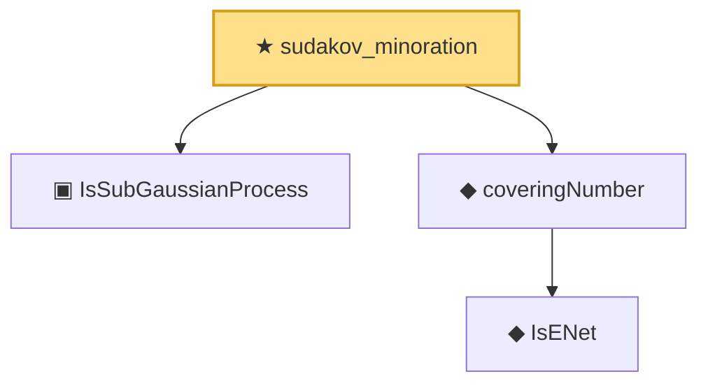

# Proof narrative — sudakov_minoration

Root: **sudakov_minoration** (theorem) `Statlib/EmpiricalProcess/DudleySudakov.lean:153` · topic `EmpiricalProcess`
Closure: 4 declarations across 3 files. Generated from `proof_graph.json` — no files were moved.

Reading order (foundations first, headline last):

  ▣ `IsSubGaussianProcess` — structure · `Statlib/EmpiricalProcess/Dudley.lean:188`  _(also used by 12: dudley_single_level_finite, subgaussian_chernoff_single, subgaussian_sup'_tail_bound, …)_
    ◆ `IsENet` — def · `Statlib/EmpiricalProcess/CoveringNumber.lean:26`  _(also used by 5: coveringNumber_anti, coveringNumber_mono, coveringNumber_lt_top_of_totallyBounded, …)_
  ◆ `coveringNumber` — def · `Statlib/EmpiricalProcess/CoveringNumber.lean:31`  _(also used by 11: metricEntropy, coveringNumber_anti, coveringNumber_mono, …)_
★ `sudakov_minoration` — theorem · `Statlib/EmpiricalProcess/DudleySudakov.lean:153` **← headline**

## Dependency diagram

