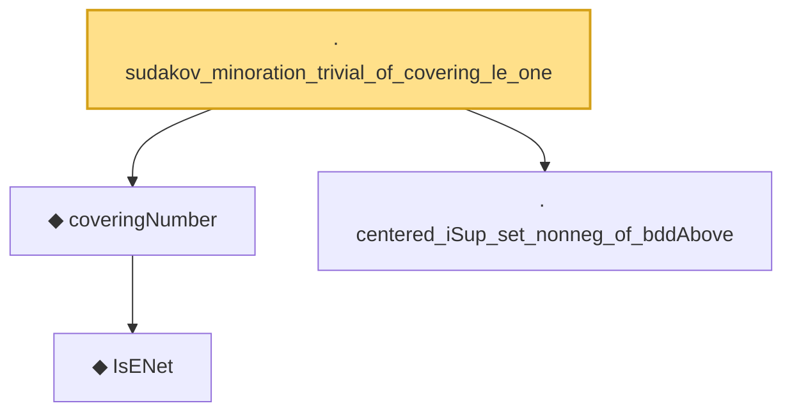

# Proof narrative — sudakov_minoration_trivial_of_covering_le_one

Root: **sudakov_minoration_trivial_of_covering_le_one** (lemma) `Statlib/EmpiricalProcess/DudleySudakov.lean:282` · topic `EmpiricalProcess`
Closure: 4 declarations across 2 files. Generated from `proof_graph.json` — no files were moved.

Reading order (foundations first, headline last):

    ◆ `IsENet` — def · `Statlib/EmpiricalProcess/CoveringNumber.lean:26`  _(also used by 5: coveringNumber_anti, coveringNumber_mono, coveringNumber_lt_top_of_totallyBounded, …)_
  ◆ `coveringNumber` — def · `Statlib/EmpiricalProcess/CoveringNumber.lean:31`  _(also used by 11: metricEntropy, coveringNumber_anti, coveringNumber_mono, …)_
  · `centered_iSup_set_nonneg_of_bddAbove` — lemma · `Statlib/EmpiricalProcess/DudleySudakov.lean:250`
· `sudakov_minoration_trivial_of_covering_le_one` — lemma · `Statlib/EmpiricalProcess/DudleySudakov.lean:282` **← headline**

## Dependency diagram

